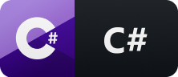

## Desenvolvedor e um entusiasta DevOps

## Backend

    
    

  
## Frontend

     
     

  
## DevOps

    
    
   

                                                                                                                                                                                                                          
## Contatos

